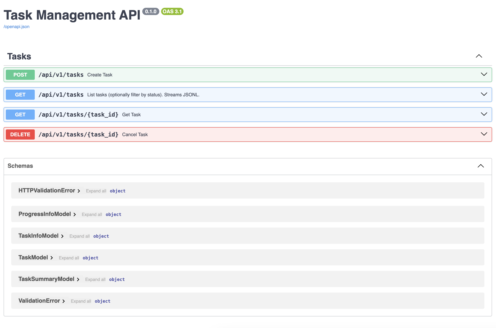
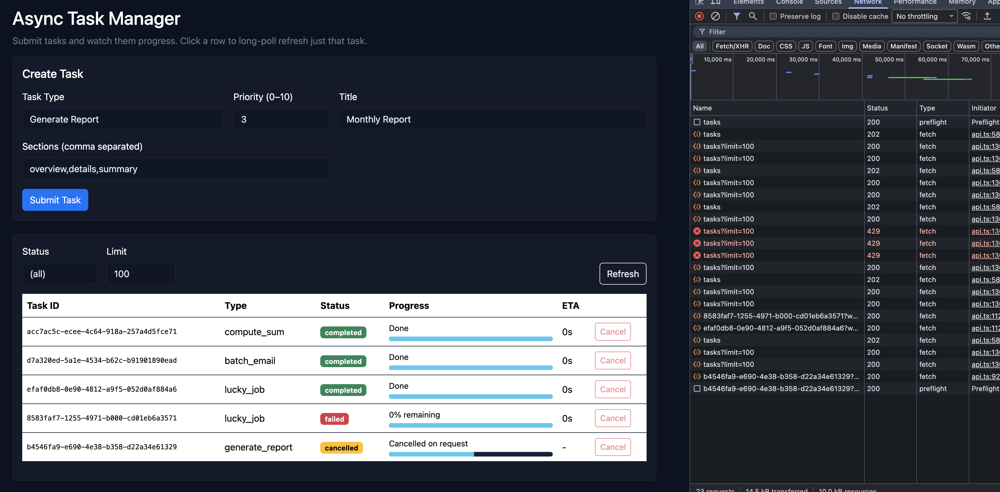
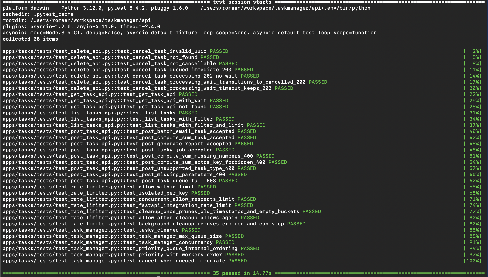
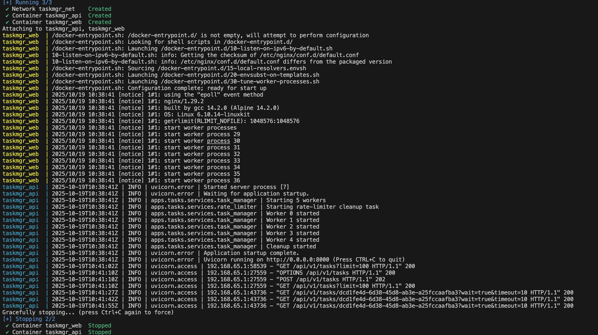

Task Manager

# Requirements

- Libraries: Use FastAPI for the API, asyncio for queues and async operations, and standard libraries like uuid and collections. No external dependencies beyond these.
- In-Memory Storage: Use a dictionary to store task details and an asyncio.Queue for pending tasks. Data is volatile and resets on restart.

## API Endpoints:

* POST /tasks: Submit a task.
  Response: 202 Accepted with task_id(UUID)and status "queued". Validate inputs; return 400 on errors.

* GET /tasks/{task_id}: Poll task status.
▪ Returns:JSON with status ("queued","processing","completed", "failed"), result (if completed), error (if failed).
▪ Optional:?wait=true for long-polling (wait upto 10 seconds for status change).

* GET /tasks: List tasks.
▪ Optional filters:?status=queued&limit=10.
▪ Stream response if manytasks(use async generator).

* DELETE /tasks/{task_id}: Cancel a task (set to "cancelled" if possible).


## Core Functionality:
- Task Queuing and Processing: Use asyncio.Queue for task submission. Run a background worker loop (via asyncio.create_task) that dequeues tasks, processes them asynchronously (simulate work with asyncio.sleep for 5-30 seconds based on type, using match for logic: e.g., sum numbers, generate fake report string, or raise errors for simulation). Update status in an in- memory dict (key: task_id, value: dict with status, parameters, result).
- Polling Mechanism: For /tasks/{task_id}, if ?wait=true, use asyncio.Event per task to notify on status changes, awaiting with timeout. This demonstrates efficient long-polling without busy-waiting.
- Rate Limiting: Limit to 10 requests/minute per IP. Track in an in-memory dict with collections.deque for timestamps. Use asyncio.Lock for thread- safety. Return 429 on exceedance.
- In-Memory Management: Dict for task storage, queue for pending tasks. Implement auto-cleanup: remove completed/failed tasks after 10 minutes using a separate async timer task.
- Concurrency: Process up to 5 tasks in parallel using asyncio.gather. Handle cancellations gracefully (e.g., via asyncio.CancelledError).

## Additional Features:
- Use Python 3.10+ specifics: match for task_type processing (e.g., matchtask_type: case "compute_sum": ...), parenthesized context managers for locks, or type aliases for task dicts.
- Error Handling: Custom async exceptions (e.g., TaskFailedError), logging, and detailed JSON responses. Use match for error classification.
- Testing: Async tests covering submission, polling (with mocks for sleeps), rate limiting, cancellations, and concurrency (e.g., simulate multiple submissions).
- Documentation: README.md with setup instructions, API docs (using FastAPI's Swagger).


# Tasks:

Plan is to implement backend stack in python3.12+, use FastAPI, asyncio and pytest PLUS also develop a tiny frontend using React framework PLUS also dockerize the applications. So the plan is as follows:

- Setup the repository, git initialize
- Add requirements, helper scripts and define project structure
- API definition and unit test skeleton added
- Implement Task Manager + Rate Limiter
- Implement unit tests
- Develop UI
- Build and test Docker containers
- Rate limiter has logic to clean up memory

# Prerequisites 
- Developed/Tested on linux / macos with bash terminal if you want to run the project locally
- Python3.12
- Node 22+
- Docker installed if building and running with containers

# Assumption
- CORSMIddleware and allow_origins="*" are set to allow frontend running on different origin to talk to backend, but in PRODUCTION this should be secured further
- Using pydantic[email] validator, pytest-timeout and flake8. Using flake8 for linting to meet PEP8
- While estimating the progress, I have assumed that the simulated time will be the major time consuming factor, hence calculating the progress based on simulated time 
- If simulated time was not a bigger factor, I would try calculating based on the input size and the time required for each atomic computation i.e. for example sum each number etc
- Added wait=true query param to DELETE task call to wait for the status change optionally, if not the current state is returned when successfully called


# How to run locally

## Backend

Initialize the python virtual environment

```sh
cd api
./run.sh init --dev
```

Run the backend

```sh
cd api
./run.sh dev
```

App will launch default on [http://localhost:8000](http://localhost:8000) and swagger docs will be available at [http://localhost:8000/docs](http://localhost:8000)

Run the backend tests

```sh
cd api
./run.sh test
```

## Frontend

A lightweight UI for your FastAPI async task manager:
- Create tasks (`compute_sum`, `generate_report`, `batch_email`, `unstable_task`)
- List tasks (streams JSONL or falls back to plain list)
- Long-poll a single task for updates
- Cancel queued/processing tasks

Bare minimal functionality has been developed using typescript, and react library. Also uses Bootstrap CDN. In order to run below are the steps:

```sh
cd ui
npm install 
npm run dev
```

## Docker 

Build and run the docker containers

```sh
docker compose build
docker compose up
```

# File structure

```
taskmanager
├── api
├── apps
├── __init__.py
└── tasks                                           App specific to TASK-MANAGEMENT
    ├── __init__.py
    ├── api.py                                        Routes related to tasks
    ├── depends                                       Dependencies from routes
    ├── __init__.py
    └── rate_limit.py
    ├── exceptions.py
    ├── helper.py
    ├── jobs.py                                       File with functions like batch_email, compute_sum, etc
    ├── models                                        Models required for validation and business domains related to tasks
    ├── __init__
    ├── task_manager.py
    └── task.py
    ├── services                                      Services layer implement the actual logic of task_manager and rate_limiter
    ├── __init__.py
    ├── rate_limiter.py
    └── task_manager.py
    └── tests                                         All tests related to "tasks" sub-application
        ├── __init__.py
        ├── test_delete_api.py
        ├── test_get_task_api.py
        ├── test_list_tasks_api.py
        ├── test_post_task_api.py
        ├── test_rate_limiter.py
        └── test_task_manager.py
├── configs.py                                            External configuration
├── core
├── __init__.py
├── exceptions.py
└── logging.py
├── Dockerfile
├── main.py                                                Main file, entry point to start the web application
├── requirements-dev.txt                                   Development requirements
├── requirements.txt                                       Minimal packages required
└── run.sh
├── docker-compose.yml
├── README.md
├── screenshots
└── ui                                                        Task Manager User Interface developed in TypeScript and ReactJS library
    ├── Dockerfile
    ├── index.html
    ├── package-lock.json
    ├── package.json
    ├── src
        ├── api.ts
        ├── App.tsx
        ├── components
            ├── TaskForm.tsx
            └── TaskList.tsx
    ├── main.tsx
    ├── styles.css
    └── vite-env.d.ts
    └── tsconfig.json
```

# Future scope 

- User authentication 

# Screenshots

## API Documentation - Swagger Doc




## User Implementation




## Test Cases 



## Docker containers and logs

